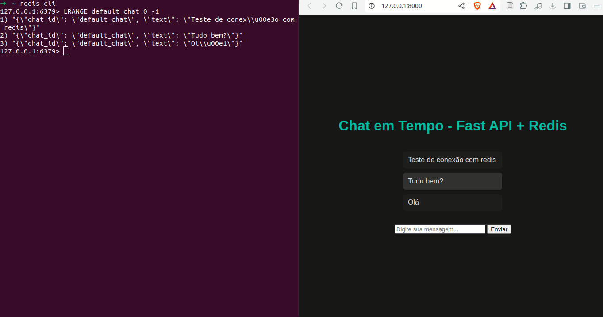

# Web Chat com FastAPI + Redis
Este projeto é referente ao trabalho da disciplina de banco de dados não relacionais

# Configuração
Para rodar este projeto, basta seguir os seguintes passos:


```bash
$ poetry install
$ poetry shell
$ uvicorn main:app --reload
```

Seu projeto, normalmente, ficará na url [http://127.0.0.1:8000 ](http://127.0.0.1:8000 )

# Programa em utilização
Abaixo segue o funcionamento do projeto.



